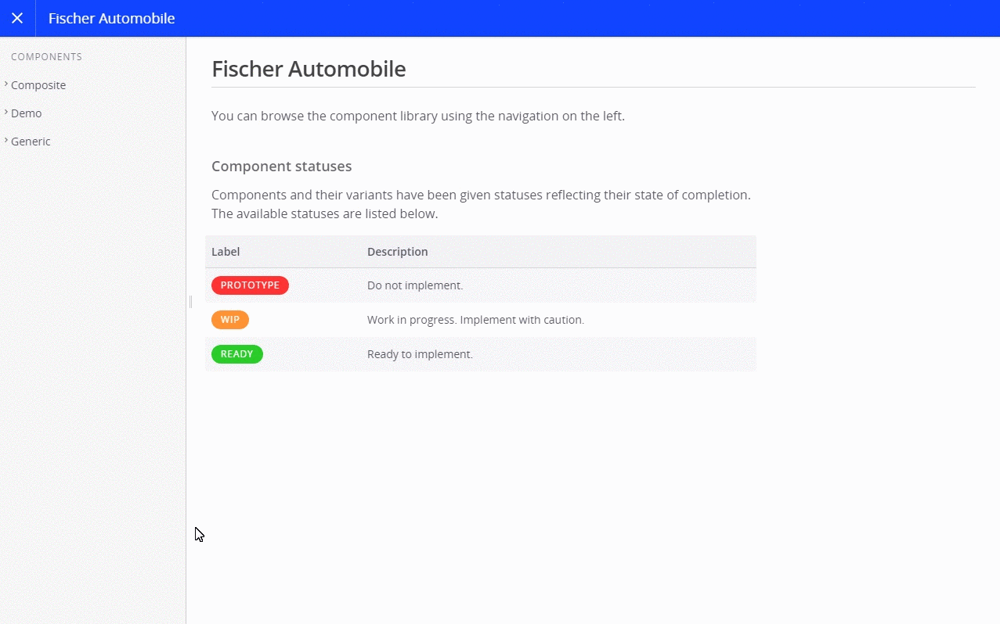

fractal-tenon [![NPM version][npm-image]][npm-url] [![NPM downloads][npm-downloads]][npm-url] [![Dependency Status][depstat-image]][depstat-url] [![Development Dependency Status][devdepstat-image]][devdepstat-url]
======================================================================================================================================================================================================================================================================================================================

is a [Fractal](http://fractal.build) add-on that let's you test your components against [Tenon](https://tenon.io) for accessibility issues.

Installation
------------

To add Tenon support to your Fractal instance, run

```bash
npm install fractal-tenon --save
```

Configuration
-------------

To add the Tenon tab to your component view and enable accessibility testing, you need to add some lines to your `fractal.js` [project configuration](http://fractal.build/guide/project-settings):

```js
'use strict';

const fractal = module.exports = require('@frctl/fractal').create();

/* Regular project configuration here ... */

// Require the Fractal theme and Tenon add-on libraries
const mandelbrot = require('@frctl/mandelbrot');
const tenon = require('fractal-tenon');

// Explicitly create a theme instance
const theme = mandelbrot(/* {...} */);

// Configure Tenon support
tenon(theme, {
    apiKey: '<TENON_API_KEY>',
    publicUrl: 'http://fractal.example.com'
});

// Let Fractal use the configured theme
fractal.web.theme(theme);
```

You need to provide two parameters to configure Tenon support:

1. **Tenon API Key**: You will find this one under the "API Key" section on your [tenon.io](https://tenon.io) dashboard (account required).
2. **Public URL**: Your Fractal instance needs to be publicly available for Tenon to fetch and test your components. Provide the fully qualified URL (including scheme and port if necessary).

If configured correctly, Fractal should show you a new panel labelled "Tenon" in your component view.



You may control its position by explicitly configuring the `panels` option of your Fractal theme (e.g. [Mandelbrot](http://fractal.build/guide/web/default-theme)):

```js
const theme = mandelbrot({
    panels: ['html', 'view', 'tenon', 'info']
});
```

Hitting the "Test with Tenon" button will call Tenon and display a short version the issues found for your component. You may view the full test results on [tenon.io](https://tenon.io);

Docker image
------------

We provide an [experimental Dockerfile](https://github.com/tollwerk/docker-fractal) for build a **Docker image** running a Fractal instance with Tenon support.

Known problems
--------------

* The client JavaScript involved requires you to use a fairly recent browser version
* The module is in a very early stage and might have bugs. Please let me know if you spot one!

To-do
-----

* Add tests


Changelog
---------

Please refer to the [changelog](CHANGELOG.md) for a complete release history.


Legal
-----
Copyright © 2019 Joschi Kuphal <joschi@kuphal.net> / [@jkphl](https://twitter.com/jkphl). *fractal-tenon* is licensed under the terms of the [MIT license](N:/sevensix/data/fractalTYPO3/LICENSE.txt).

[npm-url]: https://npmjs.org/package/fractal-tenon
[npm-image]: https://badge.fury.io/js/fractal-tenon.svg
[npm-downloads]: https://img.shields.io/npm/dm/fractal-tenon.svg

[depstat-url]: https://david-dm.org/tollwerk/fractal-tenon#info=dependencies
[depstat-image]: https://david-dm.org/tollwerk/fractal-tenon.svg
[devdepstat-url]: https://david-dm.org/tollwerk/fractal-tenon#info=devDependencies
[devdepstat-image]: https://david-dm.org/tollwerk/fractal-tenon/dev-status.svg